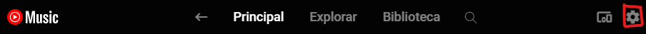
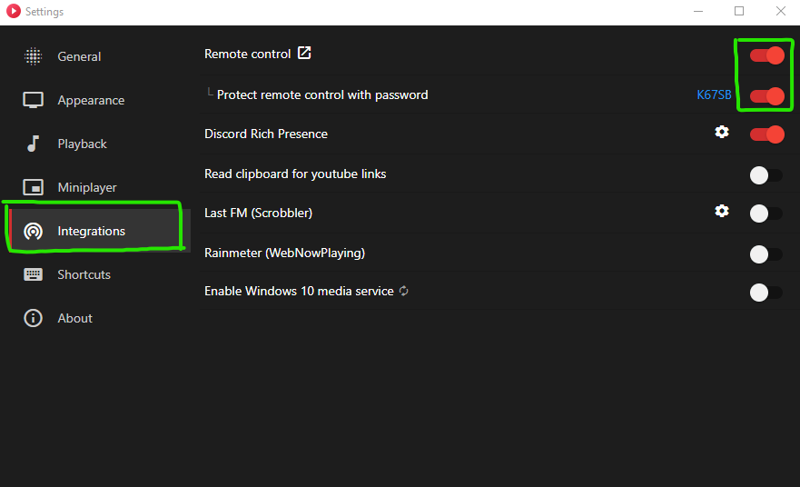
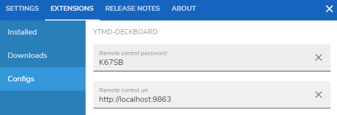

# YTMD-deckboard
A plugin to use in deckboard to control Youtube Music Desktop via Remote Control Server

## Setup

### Requirements

* Install [Deckboard](https://deckboard.app/) 
* Install [YTMDesktop](https://ytmdesktop.app) 

### Installing

#### Download prebuilt version
* Download the released [YTMD-deckboard.asar](https://github.com/Gsimken/YTMD-deckboard/releases) file
* Save it to your `{USERNAME}\deckboard\extensions` folder
   * e.g. `C:\Users\demo\deckboard\extensions`

#### Compile from source

* Clone the repository to your pc
* cd into your cloned repository folder
* Run `npm install` command
* Run `npm run install` command
  * This will build the `.asar` file and place it in your extensions folder

##### Requirements
* [Node.js® & npm](https://nodejs.org/en/)
  
## Configure

### Youtube Music Desktop
* Go to Settings

* Then Turn on Remote Control and Protect

### Deckboard

* Click in Config(Cog) >  Extensions > Configs;
* In remote control pasword put the Code of the settings  in this case "K67SB"
* In URL use your server url, default: 
http://localhost:9863

# Contribute 

If you want to make pull request, I will review them as soon as possible.

Donations to this project can be made through  BuyMeACoffee 

<a href='https://ko-fi.com/gsimken' target='_blank'>